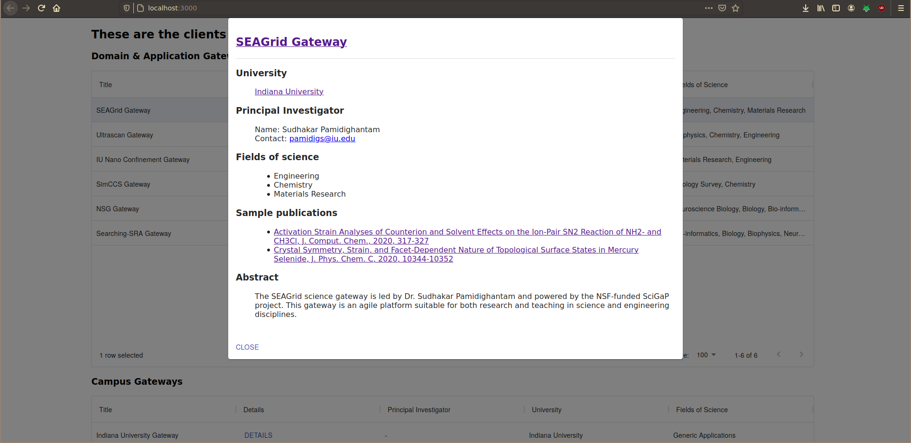

# CIRC GA position coding challenge

## Overview

The whole project consists of 4 main modules. ```data-provider-service``` is
the module that stores and provides the collaborator data to the other 3
modules. The other 3 ```*-ui``` modules display the collaborators grouped
by their type, associated university and the fields of science that they
are involved in. Each of the 3 front-end modules are also implemented
using 3 different types of web technologies. 

## Installation

After cloning this repositoru, run ```npm install``` in each of the
directories of the 4 modules - ```data-provider-service```,
```fields-of-science-ui```, ```dynamic-ui``` and ```university-ui```.

Then run the following commands in the directories of the four modules in the
following order:
```
$ cd data-provider-service
$ npm run develop
$ cd ..

$ cd fields-of-science-ui
$ npm run start
$ cd ..

$ cd dynamic-ui
$ npm run start
$ cd ..

$ cd university-ui
$ npm run develop
``` 

## Approach

### ```data-provider-service```


The tool that I used to implement the data storage and rest API service is
called Strapi. It is a headless CMS that has a great GUI for defining
relational data models (see picture above) and for inserting data. I could
have used Django as an alternative but I was familiar with starting a
project from scratch using Strapi. I had worked with Django before but I
never started a new project using Django from scratch. Whereas, I have used
Strapi before to rapidly prototype a new project. One major advantage of
Strapi is that its data is automatically available as a rest API. Also, 
making the data available as a GraphQL endpoint is as easy as installing a
plugin in the UI with just a click. Though rapid prototyping is pretty easy
with Strapi, it doesn't have give us the same flexibility that Django is
able to give. However, I feel that this is because the Strapi project is
fairly new as compared to Django and with time it too will have a lot of
features that allows more control over its content's data.

### ```fields-of-science-ui```


This UI service groups the collaborators by their corresponding fields of
science. As shown in the diagram above, the bar chart in the homepage
visualizes the distribution of different fields. Clicking on one of the
bars in the card would load the page with the list of collaborators
working on the corresponding field as shown in the picture below.


My approach to build this module was to stick as close to vanilla javascript
as possible; without using any complicated frameworks. Each of the pages for
each field of science was generated by a custom build script that I wrote
located at ```fields-of-science-ui/scripts/build.js```. This script
fetches the data from strapi and uses the Mustache templating library to
generate the field pages from the template file at 
```fields-of-science-ui/src/field_of_science.mustache```.Mustache is a
lightweight alternative to the more feature-heavy Handlebars templating
library. The build script also transforms the API response in a format
that the d3js library can use. d3js is what was used to generate the bar plot.

### ```dynamic-ui```


Dynamic UI is different from the other two UI modules because in it the UI is
generated by calling the strapi API at client side. There is no static page
generation at build time. This UI is developed using the React framework
and hence it is a single page app.The React material UI library was
used to style the React components rather than using plain CSS. Clicking on
one of the "DETAILS" button
will pop up a modal with the details of the collaborator of the
corresponding row (shown in the picture below). The collaborators are
split into two lists; one for each type of collaborator. This is just
like the current collaborator list page at the Scigap website.



### ```university-ui```


This UI module is implemented using the Gatsby framework for generating
static pages. Clicking on the number in the last column of the homepage will 
redirect to a statically generated page which lists the collaborators
associated with a particular university as shown in the picture below.

 

I decided to use Gatsby when I heard professor Marru mention the static site 
generator Jekyll when describing this coding challenge. I didn't decide to
use Jekyll because then I would have had to install the entire Ruby toolchain.
Also, I used Gatsby because it used React underneath which I was familiar
with. Since Gatsby interfaces well with GraphQL and Strapi could easily
provide a GraphQL endpoint, I decided to it in this module. However, 
since Gatsby and GraphQL were tools that I had very little experience
with, I spent a lot of time debugging this module than I could like to 
admit.